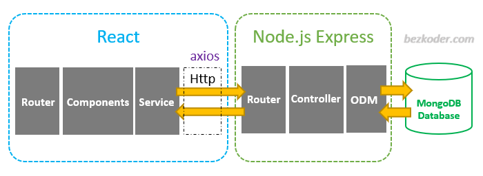
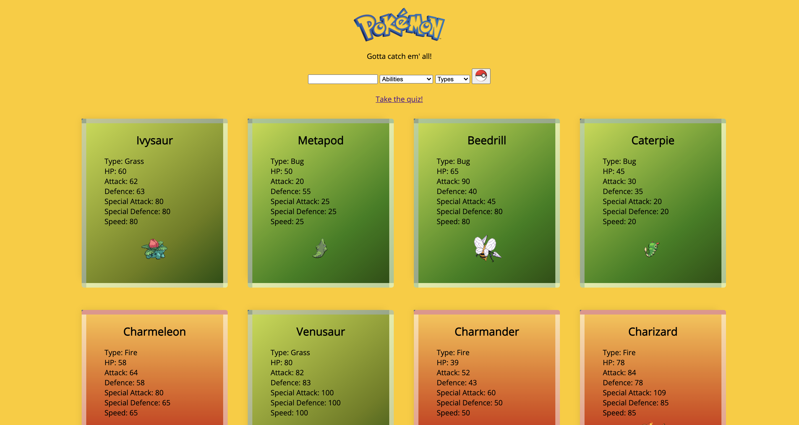

# Coder Academy - Workbook
## Assignment 1 - Term 3 (T3A1)


## Question 1
Firstly, what is source control?
  * Taken directly from the Atlassian [documentation](https://www.atlassian.com/git/tutorials/what-is-version-control), source control and version control are two terms that are used interchangeably and should not be confused for separate systems. These terms are used to describe the process of both tracking and managing the changes that are made to software on a project. This process follows the same rules whether utilized on an individual level or all the way up to enterprise level. 
  * In other words, when utilizing source control, a team or individual can keep track of how they are changing code. Once at a stable point, with source control, they can either commit their changes or revert them without harming the overall project.

So, how should version control be conceptualized? 
  * The best way to think of version or source control is to imagine that it is the basic outlines of a process or protocol that leads to more efficient and safer working when it comes to source code. By following these basic outlines, a team utilizing source control methods can protect their work from being permanently altered or damaged without consent or design.
  * In order to bring version control to the general public and make it more user friendly, several Version Control Systems have been developed.  
    * Version Control Systems (VCS) came about in the wake of the source control movement and make source control methods more readily available. These come in many forms and one of the most common out in the wild is Git. Besides Git, there are many others that are used by different groups based off preference.
  * breaking these concepts down further, imagine that source control is a garden full of plants bearing fruits of all kinds and the VCS is a guidebook on how to properly tend and maintain that garden.


Now that the basic definition of the term and its different forms of reference are covered, let's dive into the process of using source control on a large project (while remaining VCS agnostic to limit the confusion that may arise from use of specific terms that may work in one system but not another). 
1. Project initiation.
    * In the earliest stage of a project, it falls to the leader or PM to establish the basic rules of source control that will be adhered to until the work is finished and the project delivered to the customer.
    * Here the PM will create a main branch which functions as the universal and 'real' version of the project.
    * The team will be informed of the rules and protocols when it comes to attempting to manipulate this branch.
    * Administrators will be assigned who will be in charge of controlling how the team modifies the main branch.
2. localization of tasks.
    * At this stage indivudals who have been assigned jobs in relation to the source code will copy or clone a version of that code to their local machine. 
      * This step is the first in the group of benefits that come with source control. Each team member is copying a version of the code to a branch on their local machine rather than working on the main branch itself. They are protecting the integrity of the source code while allowing themselves free reign to change and add whatever they see fit. 
3. Submission of personal work against main branch. 
    * Once team members have completed their assigned work they will then submit their work to the main branch through a push from their local machine. 
      * This push stage is still separate from the main branch. Any changes made to the source code locally are still 'locked' within an environment that can be reviewed by admins before being made official against the main branch of work. 
4. Review of changes and officiating of pull request.
    * Any changes will be reviewed once pushed to the remote repository that stores the source code separately from all local environments. 
    * The push made in step three will lead to an admin receiving a pull request which will indicate the changes being made to source code. From here the admin is responsible for confirming or denying changes.
    * If the work done by a team member on their local machine is appropriate, their push request that registers as a pull request on the part of the admin will be accepted and all changes will be made official and merged into the main branch. 
    * If admins have done their due diligence, the main branch will be updated with all changes made.
5. Updating local machines with most recent changes.
    * Once changes are made to the main branch, it is best practice that anyone involved on the project whose work may be affected by those changes pull them to their local machine. This will save any redundancies arising from teammates completing a task that has already been finished. 
Steps 1-5 will be repeated until the project is ready for delivery. Immediately, it should be clear to see how valuable the version control process is for projects that require collaboration as it limits the potentiality for human error and maintains high levels of integrity for source code.

---
## Question 2
What are the most important aspects of quality software?
In no particular order, the most important aspects of quality software are:
  * Reliability
    * This is aspect that addresses consistency. For software to be considered reliable, it has to constantly produce the expected outcomes with few to no errors. Those errors that do get thrown should be expected and handled correctly through error handling on the part of the developer. The user should never be left scratching their head wondering if the code will work or not. 
  * Understandability 
    * As stated in Silas Reinagel's [article](https://www.silasreinagel.com/blog/2016/11/15/the-seven-aspects-of-software-quality/), high quality source code should always be both simple and obvious. That is not to say that the code should be dumbed down or inelegant, rather, a programmer who did not originally work on the code should be able to look at it and immediately or very quickly be able to understand it. 
  * Modifiability 
    * Source code should be written in a manner that allows for iteration and change at later stages without completely breaking that code's intended functionality. It should be possible to modify those parts of the code that are meant to be interacted with without running into numerous errors that have been caused by modification that are impossible to find. 
  * Usability
    * The source code that you develop should not require the user to have to go beyond your code in order to implement it. In other words, code should be written so that another developer can easily apply it to their own project without having to scour the internet in order to understand how to plug it into their work. 
  * Testability 
    * The source code you write must not only meet the standards of implementation, it should also come with prepared tests that allow a new adopter the ability to see how it is crashing if it fails to work. In addition, this testing should be set up in a manner that is easy to use. If your software is harder to test than it is to write, then you have most likely created a non-quality piece of work. 
  * Portability 
    * The source code that you write is platform and operating system agnostic. Of course, there may be edge cases that require the development of software for a specific operating system. However, on the whole, it is best practice to write source code that can be ported to multiple operating systems and that can run on a range of hardware. Not only will this lead to higher quality software, it will also increase its chance of being adopted by more users. 
  * Efficiency
    * The idea here is that you want your software to put as little strain on the physical device and networks running it as possible. If your software is using a massive amount of memory to run, thereby slowing down other systems, then you are creating software that has not been designed with efficiency in mind. The bottom line is that efficient software is software that uses as little resources as possible while running. 
<br>

These elements combined together form the basis of software that is considered quality in industry. They should apply universally and, as a result, allow us to accurately compare work from a range of developers and understand whether or not that work will meet industry standards of quality. An important note to take from this is that a good software developer will understand whether or not certain aspects need more time and attention and which ones can be handled with speed. This understanding of the aspects of quality software and their relative importance to a project is an immensely important skill that allows for on time delivery of work in industry. 

--- 
## Question 3
First things first, what is the MERN stack?
  * MERN stands for MongoDB, Express, React, and Node. These are all individual technologies that, when "stacked" or used in conjunction, allow for the creation of 3-tier architecture (front end, back end, database). The real beauty of this whole system is that through the stack it is possible to create all of this solely through coding in JavaScript.

In order to simplify the structural analysis of a MERN stack app, let's break it down into three parts:
  * Front End 
    * In simple terms, what the user actually sees.
    * in MERN stack, front end is handled by React.js
      * React.js:
        * React is a JavaScript framework that allows for the creation of dynamic interfaces that can effectively and capably respond to user interaction. In essence, with react it is possible to utilize components built into the React framework that create a pleasing visual interface. Once set up, it can then be easily connected to data on the backend that will allow for actual functionality.
      * This is considered the top, first, or front-end display tier of the architecture pattern. 
  * Back End
    * Express.js & Node.js:
      * these two go hand in hand as the Express.js is a framework that runs inside of a Node.js server.
      * Express being a handy and already created framework allows for access to its built in models that allow for powerful and fast URL routing in addition to handling the typical HTTP requests that come about as a result of user interaction with the architecture in the pattern.
      * It is important to note that the Express.js framework is built to work in conjunction with the methods and models that Node.js makes available for us. These methods and models work with MongoDB and thus allow for interaction with the database without having to explicitly be within the database.  
    * This considered the middle, second, or application tier of the architecture pattern.
  * Database
    * MongoDB:
      * The database utilized for storage of user information or any other data that is pertinent to the app that must be persisted over time. 
      * React.js creates a JSON document that is sent through the Express.js framework for processing. Once processed, this information is stored within the database and can be accessed again in the same fashion.
        * Note that the assumption here is that the JSON document created in React.js is valid and can actually be processed by Express.js.
      * The reason MongoDB is used over other databases is that it was designed to store JSON data natively rather than having to convert and compile into another language before processing. In addition, the query language with which it is accessed is built on JavaScript meaning that its use will come naturally to a developer working in JavaScript. 
    * This is considered the bottom, third, or database tier of the architecture pattern.
  * To learn more about where this run down came from and the nitty gritty of how the stack is comprised, information can be found [here](https://www.mongodb.com/mern-stack)
```javascript
  // wasn't sure if this section should be added... 
  //   Now that the stack's make up is explained, lets look at an actual app utilizing the MERN stack and see how each piece works. 
  // * [This](https://www.bezkoder.com/react-node-express-mongodb-mern-stack/) is the source information for the app in question.
  // * Pictorial representation of stack breakdown:
  //   *  
```

## Question 4

Most practices in the IT industry that have staying power are those that have a set protocol that is repeatable and will provide similar levels of results through many iterations. Below are the 6 skillsets and knowledge that would most help a team deliver on a project, with some variation depending on the size of the project:

  1. Industry knowledge
      * In this specific scenario, industry knowledge isn't entirely necessary as the work has already been won. However, in most real-life cases, work or projects will be handed out to the the competitor who proves that they are the most equipped for delivering on the work desired by the client. In order to do this it is critical that team leaders who are writing proposals to win work or taking clients out for meetings are up-to-date with the latest industry trends and are capable of discussing and showing why their team is most suited to handle the project. Perhaps a new language or an update to a language has been pushed out that a client wants their work to be written in. Or perhaps standards have changed for methods of development. That list of potential changes is very long and proves why it is valuable to have members of the team who are more of the generalist skillset for this stage.
  2. Funding capture and networking
      * Again, not necessary for this scenario specifically but generally very important. This step falls just in line behind step 1 and the two could almost be merged together. Ideally, a team will be comprised of a varying group of individuals with different capabilities and weaknesses. Once work has been won, how is it going to be funded? Who will provide those funds in order to bring the ideas of the client into reality? While in most cases companies can handle small projects funding needs on their own, in many cases large projects require support from outside investors. And, while it remains true that you cannot buy your way to success, it will certainly help give your team access to resources that will allow them to deliver a project or piece of work that should exceed the expectations of the client. 
  3. Project management
      * Once the work has been won and funding is taken care of, the team will need to depend upon leadership to implement a project plan that will lead to successful delivery of work in a timely fashion. Industry standards indicate that agile methodology (described previously and referenced [here](https://plan.io/blog/what-is-agile-project-management/)) is the go to for project management. Having a project manager on the team certified in agile methodology is a huge benefit to any project as it will allow for proper setting and attainment of goals that will keep the whole team on track in regards to delivery. Each member of the team will be aware of what their specific tasks are and when they are required to be finished while not having to worry about the total project which would be a waste of their time and reduce their efficiency. 
  4. Source control 
      * Once the implementation plan has been put in place, the lead designer can set up source control for the project. As mentioned in section one at the beginning of this work, source control is how leaders of a project can be sure to maintain the integrity of the source code until it is ready to be delivered to the client. The team lead in charge of administering and setting up source control for the project will now be able to decide which VCS (Version Control System) they want to use and who should have the ability to accept pull requests which will alter the actual working product rather than a local copy on an individual's machine. This leader will also be in charge of making sure that the team under them has working knowledge of the source control methods planned for the project and is aware of what they can and cannot alter as they work through their assigned roles from step 3. 
  5. Ability to create quality software
      * Returning back to the topic of quality software from section two, this is the stage of a project's lifecycle where this knowledge comes into play. Once all the red tape has been cut through and removed it will be time to actually start developing the software to be delivered to the small business. Agile practices alone won't stop developers from producing non-quality software and so it will be critical that each team member maintains a high level of expectations in relation to the code they are writing. If it does not abide by the 7 aspects of a quality piece of software laid out in section 2 then it most likely will lead to delivery of product that fails to meet the expectations of the client. These 7 aspects once more are: 
        * Reliability
        * Understandability 
        * Modifiability 
        * Usability
        * Testability
        * Portability
        * Efficiency
  6. Maintenance of software post delivery
      * Finally, once the project has been delivered and the client is satisfied with what they paid for the developer then becomes responsible for making sure they can address and fix any issues that may arise later on. It is not enough to simply deliver a product. The team will have to be accountable for their work and be able to be called on to fix issues that arise in the production environment once the software is in the clients' hands.

Are these 6 points the totality of skills that make for a successful project delivery? Perhaps not. However, with these values instilled into a software companies' employees, it should be much easier to deliver a standout product and avoid the pitfalls that come with having a team that is unprepared for work in the real world.

---

## Question 5
For Questions 5 and 6, let us analyze the work I did on the Ruby Marketplace Application for the end of term 2. It can be found [here](https://github.com/Ausiarm/T2A2-marketplace-code).
This marketplace project required general understanding of how Ruby on Rails works in conjunction with a database and a third party system that hosts the database. The skills I made use of to best achieve this goal are as follows:
  * Ruby on Rails
    * The main programming language of the project.
    * Through working with ruby in conjunction with ruby on rails, about 99% of all backend logic was created. 
    * In respect of the MVC pattern that we learned about in term two, I made sure that my controllers were lean and designed for hand-off from model to view. 
  * PostgreSQL
    * PostgreSQL was the database that was linked to my models when generating the project. 
    * Manipulation of the PostgreSQL database required understanding of the query language used to interact with the databases themselves.
  * Webhooks
    * This one was a bit more of a challenge for me. It required the creation of a method that would pull information about the purchaser using stripe to pay. This was This information would then be fed into the database for storage of user and product information. 
  * Stripe
    * Using stripe allowed me to practice implementation of gems.
    * It also led me to try to better understand why or how a payment system can be implemented into a marketplace by wiring it into your code effectively. 
  * Devise
    * Using Devise allowed me to practice implementation of gems
    * Given my realtively small base of knowledge, implementation of an authentication system from scratch would have taken up a great deal of time.
    * Working with devise helped me understand why it is necessary to implement authentication and authorization into a project like this.
  * Routing
    * Before beginning the project, CRUD operations made practically no sense to me. Through working on the marketplace app I have gained a beginner level understanding of how a browser interacts with a server by way of requests being launched through the CRUD operations.
  * Gems
    * Before this project I hadn't properly grasped why or how to use a gem to amplify my own work. With the simple from, devise, and stripe gems this all changed. It took some time to understand how to actually make use of the gem once it was installed but once I grasped that I could immediately see why they are valuable. 
  * Project Management
    * While before this project I used trello for a couple different working projects, I had never implemented it with such effectiveness. Using it this time around I made sure to properly populate it with information so that it would actually serve to help me keep on track and manage my time and tasks effectively.
  * JavaScript (minor)
    * I implemented a small script in order to get some nav-bar functionality but other than that there was very little JavaScript incorporated.
  * source control
    * Using github as well as heroku meant that the changes or modifications that were made to the project over time were trackable. It also proved invaluable at certain stages when I had deviated too far from my originally intended design. Normally, these modifications would permanently mutate the overall product but with the ability to reset to earlier points in development this was a non-issue.
  * MVC Architecture pattern
    * I have constantly heard about why the MVC pattern is helpful for structuring a project and this time around it proved why people are in favor of it so strongly. 
    * I made sure that I worked to keep logic out of views and work through the controllers in order to interact with the databases.


## Question 6

From the outset I planned to be ambitious with my work in the hope that coming short of intended design would still yield a functional product.
  * I met quite a few of these intended plans as I was able to:
    * Properly implement devise in order to allow for the creation of user accounts.
      * Along with this I managed to build in a form of admin monitoring that would inhibit users from editing posts that they did not create. This was done by simply removing the links to edit for anyone who was not the creator or an admin.
    * Created a card system whereby a user could create a guide or tutorial on an exercise that they feel is worth sharing and add it to the general repository of stored training methods.
      * This was possible with the help of the bootstrap gem which proved to be very valuable for expediting the creation of elements with proper CSS styling without much input on my part. 
      * This general repository is known as the foundation and can be seen [here](https://themelioo.herokuapp.com/). From that page a user can click on the link in the navbar and be taken directly to the page featuring the different guides posted by all other users.
    * Created an interface that was generally intuitive that would not crowd the user with information upon entering.
    * Implemented a payment system that could accurately handle user payments by interacting with a webhook that would route user information back to the server for storage. 
    * Created a database that would be able to store user information and make sure that user information persisted over time. 
    * Hosted the website on a third party service that allows for continual access to the site for free. 
    * Used knowledge gained from class to effectively create a ruby application that is a two sided marketplace.
    * I managed my time well and made sure to have all the theoretical or planning stages finished well before it came time to actually code anything.
      * The tool that best helped me manage the project and time within was trello. Its features and functionallity really helped me to know what tasks were absolutely necessary and what could be added later on without ruining the app or falling short of goals. 
      * Furthermore, this was very helpful as it allowed me to effectively finish tasks I had set for myself during the planning phase rather than just winging it and having no idea what to move onto next. 
  * It is all well and good to list the successes of this endeavour but the failures should also be addressed. 
    * I was unable to properly implement purchase access for users. 
      * By this I mean that the marketplace functions more like a service for one time payments rather than a subscription page that allows users to access all the information that they have subscribed to indefinitely until payment fails. 
      * My temporary solution was to create a myfoundation page which would allow users to see the purchases they have made but only in a preview sense.
      * In the future what I would like to add is the ability for a user to purchase something and automatically be redirected back to their myfoundation page which would show previews of the guides they own. By clicking into them a user should see a different page rather than simply the view page that is accessible when purchasing the card.  
    * There is practically no styling done on the project so the end product, while having good functionality, needs work to be more pleasing to the eye.
      * Specifically, I would like to work more with bootstrap's built in functionalities to further enhance the styling of the website without taking away from its intrinsic simplicity. 
      * Note that we were explicitly informed that styling would not be graded and as a result it was not something that I chose to focus on. 
    * I would like to have had more effective use of simple form to create forms that stored more valuable information. 
      * My forms were fine but probably too safe. There was little to no styling done on the create page that users are directed to and, while not game breaking, it still would be nice to have this aspect more tended to. 
    * Databases were limited and as a result the scope of the application was much less than I would have liked to cover. 
      * Essentially there was only one user database when in reality there should have been several in order to respect the normal forms rules that apply to databases. 
    * I wanted to implement a system that would allow for the user to properly search through listings based off keywords but failed to do so in the time given. 
      * In addition I wanted to implement a rating system that would persist and allow for posts to become favored over time based off crowed support. 
    * A general note for the future was that my use of gems limited me from going beyond their base functionality. I should have focused on using them to build a bigger and better product rather than just a carbon copy of other sites that I like or enjoy. 
    * Probably the first and most important lesson I learned through this work was that I need to keep my base ideas simple as they quickly bloom beyond originally intended scope due to the nature of how programming methods work. One thing constantly snowballing to another can work to the advantage of someone who stays simple at the start. On the flip side, in my case, this snowballing created far more complexity and issues with certain parts of the project. Trying to remedy these issues took away valuable development time that could have been spent better elsewhere.

---
## Question 7
As this [article](https://medium.com/@rianna.cleary/control-flow-in-javascript-9c63d0c98bb9#:~:text=Control%20flow%20in%20JavaScript%20is,loops%2C%20conditionals%2C%20or%20functions.) states, "Control flow in JavaScript is how your computer runs code from top to bottom." in other words, code will be processed line by line and churned out in the order that it was placed on the page. However, in JavaScript there are several different forms of altering that control flow to force execution of certain operations before moving on. These are classed into three groups; loops, conditionals, and functions. Each of these can be represented by a few different forms of code and some of them are grouped and listed below:

  * Conditionals
    * While it may appear to be a misnomer as we often use the word condition when discussing for loops, conditionals are an entirely different class of operation. They function by creating a set of potential conditions that, if matched against an input, will execute and present information that is pertinent to that one condition. 
    * An example of a conditional in JavaScript is a switch statement(known as a case statement in other languages). In the specific example below we can see a switch statement in action. First, a function is created which receives some input, in this case (num). Num is a stand in that could be called anything, it is simply meant to represent what form of input we want, in this case, a number. From here the function is opened and we declare or invoke the switch statement. We indicate that we want the statement to run using the num input from the function that houses the statement by placing it in parenthesis after the switch keyword. Once this is set up we then create the cases which could be as many or as few as are needed based off the expected input. In this case, we are looking for any number in the range 1-7. Each specific case or instance of a number is bound to a specific action that returns a string representation of the day of the week based off the number fed in as input. Once this is set up, calling the function name (or in the case below, console.log()) along with a number 1-7 will activate the switch statement and return the appropriate day of the week. 
    * It is important to note that in the example below, as there is no error handling, if a user entered 8 with the getDayOfTheWeek() function then there would be no return as there is no case for the number 8. 
    * Switch statement example:
```javascript
function getDayOfTheWeek(num) {
 switch (num) {
  case 1:
   return 'Monday';
  case 2:
   return 'Tuesday';
  case 3:
   return 'Wednesday';
  case 4:
   return 'Thursday';
  case 5:
   return 'Friday';
  case 6:
   return 'Saturday';
  case 7:
   return 'Sunday';
 }
}
console.log(getDayOfTheWeek(4))
// 'Thursday'
```
  * Loops
    * Just as the name implies, a loop statement will stop code execution from continuing further until it is finished iterating over the information that it is meant to scour. This means that if a developer is not careful and they create an infinite loop, then the rest of their code will never execute. There are a few different types of loops but for our purposes I will analyze a basic for loop.
    * An example of how a non-infinite loop works in JavaScript is included in the code that you see below. What is occurring here is that the user creates an array comprised of three string entities. They then invoke the for loop and enter the conditions under which the loop will continue to run. In this case, the loop creates a variable, i, and sets it equal to zero. Then it states the condition under which the loop should continue to run. In this case, as long as the value of i is less than the length of the edm array. The length of the edm array is three as it has three entities in it. Finally, each time the loop runs and the condition of its running is not met, i will be incremented by one. Internally there is a console.log statement which prints the value inside the parenthesis that follow it to the console. Within this console.log we see `edm[i]`. This represents the index of the array and by using i instead of a hard coded value like 1, console.log statement will continually shift in position as i increments up to the upper limit of the array.length. All of this in conjunction means that the log statement will operate on each entity within the array and each name will be printed to the console. 
    * For loop Example:
```javascript 
const edm = ['House', 'Dubstep', 'Drum and Bass']
for (let i = 0; i < edm.length; i++) {
 console.log(edm[i])
}
// 'House'
// 'Dubstep'
// 'Drum and Bass'
```
  * Functions
    * A continuation of the discussion above about loops and conditionals, functions allow for the storage of other actions and or logic processes that can be activated by calling the function later on in the code. In order to create a function, one invokes the function keyword followed by the name the user wants to assign the function in camel case. In the example below this is "printGenre" and "printFoods". Note that camel case is a form of typing in which a word has spaces omitted and each new word begins with a capital letter. After creating and naming the function the user decides if the function will take any input parameters. In our example it does, the word arr which is meant to represent an array that will be fed in when the function is called later on. Inside the function one may incorporate any action they wish and in this case we see two for loops have been involved. Both of these for loops are doing the same thing as our example above so I won't explain that portion again. In addition to creating the function itself, we can also see two constants have been created. Both of them are arrays populated with three string entities respectively. With the set up done, in order to use the function to run the for-loops over the array constants that have been created we simply have to call or type their names and include the parameter that we want to feed into them in their parenthesis. In this case, the two constants that we have created are what we will feed into the functions and as a result of the for-loop functionality each of the strings in the array's are printed off by the console.log statements within the functions. 
    * Example:
```javascript
const edm = ['House', 'Dubstep', 'Drum and Bass']
const hungryFor = ['pizza', 'sushi', 'french fries']

function printGenres(arr) {
 for (let i = 0; i < edm.length; i++) {
  console.log(edm[i])
 }
}
function printFoods(arr) {
 for (let i = 0; i < hungryFor.length; i++) {
  console.log(hungryFor[i])
 }
}
printFoods(hungryFor)
printGenres(edm)
// 'pizza'
// 'sushi'
// 'french fries'
// 'House'
// 'Dubstep'
// 'Drum and Bass'
```
---

## Question 8

From the MDN [documentation](https://developer.mozilla.org/en-US/docs/Glossary/Type_coercion) on JavaScript, Type coercion is the automatic or implicit conversion of values from one data type to another (such as strings to numbers). In layman's terms, type coercion is the process of transforming a string into a number data type. This process is done implicitly or without the user having to write code that will carry out the coercion operation.

Implicit Coercion:
  * Example:
```javascript
const value1 = '5';
const value2 = 9;
let sum = value1 + value2;

console.log(sum);
```
  * In the above example, type coercion is simply and concisely displayed. First, note that value1 is set as a string data type and value2 is set as a number data type. Next we see that the variable sum is created that adds these two value constants together. But wait, shouldn't this be impossible? How can someone add a string and a number? They are two different data types and as a result trying to add them should return an error! However, thanks to type coercion being implicit, the JavaScript compiler "decides" to turn the number 9 into a string '9'. Once this is done on the backend, the two strings are concatenated and, when the console.log(sum) line runs it will output '59' to the console.


## Question 9
From the MDN [documentation](https://developer.mozilla.org/en-US/docs/Web/JavaScript/Data_structures) on JavaScript, there are two sets of types in the language; primitive values and objects.
  * Primitive values are all types (other than objects) that define immutable values. 
    * These values are comprised of seven different types:
      * Boolean
        * The boolean type is used to depict a logical entity. It can have two values, either true or false. Using the if else statement in the example below we can see that the console has two options, it either logs the first string if the boolean conditional is true or the second if the boolean conditional is false. Why is this valuable? With the boolean type it is possible to check whether or not a condition exists. If it does (or equates to true) then we do one thing and if not, then we do the other.  
        ```javascript
        /* JavaScript if statement */
        if (boolean conditional) {
          // code to execute if the conditional is true
        }
        if (boolean conditional) {
          console.log("boolean conditional resolved to true");
        } else {
          console.log("boolean conditional resolved to false");
        }

        /* JavaScript for loop */
        for (control variable; boolean conditional; counter) {
          // code to execute repeatedly if the conditional is true
        }
        ```
      * Null
        * The null type is used to refer to a value that is either nonexistent or invalid. In the case of the example below we can see that the function is set up to take one parameter, a string. The string is then stored as a constant m and matched against a regular expression that will return any vowels that are contained in the string. In order to simplify the testing process the code has been set up so that in the case that m explicitly equals null, the statment will return 0. In the event that there are vowels then the console will instead return the number of entities that comprise the new m constant. In other words, we can use null to test whether or not something exists, if not then we can quickly operate on that rather than having to write more code that would be redundant or unnecessary. 
        ```javascript
        function getVowels(str) {
          const m = str.match(/[aeiou]/gi);
            if (m === null) {
              return 0;
            }
            return m.length;
          }

        console.log(getVowels('sky'));
        // expected output: 0
        ```
      * Undefined
        * Undefined is the type value assigned to variables that have just been created and as a result, have no value. It can be seen as a placeholder until value is assigned to a variable. In the example below this is demonstrated in the var x that is instantiated without a value. When the user attempts to console.log the value of x, as it has no value assigned, the console statement will include undefined. 
        ```javascript
        var x; //create a variable but assign it no value

        console.log("x's value is", x) //logs "x's value is undefined"
        ```
      * Number
        * unlike in other languages like ruby, there is only one way to represent integer or whole number values in JavaScript. This is what the number data type is used for. In addition, there is no distinction between the differing forms of numbers, so decimal values, whole numbers, and all other forms of numericals are covered under the number data type. 
      * BigInt
        * Almost an extrapolation of the Number type, BigInt is used to represent numbers in JavaScript larger than 2^53 - 1. The reason this is implemented is that the number type cannot function above a set safe threshold. In order to determine or see this threshold one can enter `Number.MAX_SAFE_INTEGER` into the console. 
        * An important note is that BigInt values and Number values cannot be mixed in operations and JavaScript will not run type coercion. 
      * String
        * Strings are sequences of characters that are used in JavaScript to represent text. In the example below we can see that in order to create a string, the set or sequence of characters must be wrapped in quotes which can be single, double or backticks. Strings can be concatenated with the `+` operator to create long sentences or return specific messages based off user interaction. 
        ```javascript
        const string1 = "A string primitive";
        const string2 = 'Also a string primitive';
        const string3 = `Yet another string primitive`;
        ```
      * Symbol 
        * The symbol data type is used by invoking the `Symbol` function. Once assigned to a value the symbol moniker will assign that value a unique identity. The example below indicates this by showing two symbols that are seemingly exactly the same. However, as we see, the equality operator returns false indicating that these two are, in fact, not equal and thereby proving that each symbol is a unique identity. 
        ```javascript
        Symbol('foo') === Symbol('foo')  // false
        ```
  * Objects
    * In JavaScript, an object is a collection of properties. Property values in objects can be of any data type as well as whole other objects. This nesting of value levels leads to the ability to create very complex data structures. Each property within an object is identified using a key value. In the example below we can see that the variable car is instantiated as an object containing three keys that are bound to values of different data types. The first, myCar is a string. Second, getCar is a function. Third, special is a variable. As we can see, the object is populated by multiple different data types and in order to access these types within the object we simply have to call the name of the object, in this case, car. Then append it with the key that we want to access the value of. doing this will return the value associated with that key. 
    ```javascript
    var sales = 'Toyota';

    function carTypes(name) {
      if (name === 'Honda') {
        return name;
      } else {
        return "Sorry, we don't sell " + name + ".";
      }
    }
        var car = { myCar: 'Saturn', getCar: carTypes('Honda'), special: sales };

        console.log(car.myCar);   // Saturn
        console.log(car.getCar);  // Honda
        console.log(car.special); // Toyota
    ```


## Question 10
For this question, rather than leaning on a resource from someone else's guide, I will use my own practice work with arrays in JavaScript. It may not be the highest level of technical efficiency but it does represent my genuine understanding of array manipulation, which I feel is more appropriate for this answer.

Code Examples: 
  ```javascript
  var uniqueInOrder=function(iterable){
      return iterable.split('').filter((i,idx) => iterable[idx-1] !== i);
  }

  // using filter to test and understand it more

  function lessThanTen(array) {
      return array.filter((arrayItem) => arrayItem > 10)
  }

  console.log(addOne([2, 14, 0, 2, 27, 33, 30, 0, 1, 11]))


  function isPrime(num) {
    for (let i = 2; num > i; i++) {
      if (num % i == 0) {
        return false;
      }
    }
    return num > 1;
  }

  const primeCheck = array => console.log(array.filter(isPrime))

  // primeCheck([-3, -2, -1, 0, 1, 2, 3, 4, 5, 6, 7, 8, 9, 10, 11, 12, 13])


  // function isBigEnough(value) {
  //     return value >= 10
  //   }

  // input = [2, 2, 0, 2, 3, 3, 0, 0, 1, 1];

  // return input.filter((i,idx) => input[idx-1] !== i)


  // console.log(uniqueInOrder('AAAABBBCCDAABBB'))
  // uniqueInOrder('ABBCcAD')         == ['A', 'B', 'C', 'c', 'A', 'D']
  // uniqueInOrder([1,2,2,3,3])       == [1,2,3]

  const stringBoi = 'the string is a datatype in javascript that is used to represent speech'

  //Manipulation of a string into an array:

  // old or traditional way
  const splitString = stringBoi.split(' ');

  //new ES6 way using the spread operator
  const elipsesString = [...stringBoi];

  //another new way using Array.from
  const arrayFrom = Array.from(stringBoi)

  console.log(splitString)
  console.log(elipsesString)
  console.log(arrayFrom)

  let myArray = ['value1', 'value2', 'value3']

  let mySet = new Set(myArray)


  const setToArr = Array.from(mySet)

  // console.log(mySet)

  // console.log(mySet.has('value1'))

  // console.log(setToArr)


  const firstName = 'frederick';

  const capitalizeName = [
    // Capitalize the first character of the array. Use the spread operator to turn the name that is fed in into an array, then call on the 0th element of that array. Then turn that element into it's uppercase version. Note that this code will return the first element of the string only, nothing else. 
    ...firstName[0].toUpperCase(),

    // Ignore the first character and return the return the rest of the array. Spread operator will again create an array from the string being passed, except this time it will lop off the 0th element and keep the rest.
    ...firstName.slice(1)
  ]
    // Join the array produced above to make a single string
    .join('');

  console.log(capitalizeName); // Frederick


  ```

  1. uniqueInOrder
      * While this function does not take an array as an input, it does use the `.split('')` method to create an array and populate it with each letter of the string passed in as the original parameter. This is helpful as it allows us to operate on a string entity as if it were a number of several individual string characters. With the `.filter()` method it is then possible to actually apply rules onto this newly populated array in order to return only the elements that we are specifically looking for. The filter method is so powerful because we can pass an anonymous function into it to specify exactly how we would like to filter. In this case, all elements that are non-unique will be removed. 
      * Note that in the case that we want to put the string back together, we can call `.join('')` after it filtering and the filtered entities will be combined into a single string. In the `.split()` and `.join()` methods, what is passed into the parenthesis is what the logic processor will use to know where to split and join the values at. In the case above we use `('')` to indicate that we want it done after each element. You could choose to put `('j')` in the parenthesis and it would only split and join where j's appear. 
  2. lessThanTen
      * Continuing on with my experimentation with the .filter() method, this time I used it in order to process an array and remove each element in the array that is less than ten. The returned array from this filter method will now only contain numbers greater than ten. (As you can see I was excited to work with .filter())
  3. isPrime / primeCheck
      * Here we have a predefined function that is called isPrime, its sole purpose is to determine whether or not the number passed into it is a prime number. Here is where the power of chaining methods on an array comes in. We take an array and we call .filter on it, but this time, instead of passing an anonymous function, we can pass in our isPrime method. Now it will search through the array of numbers and filter out any number that does not satisfy the isPrime function specification.
  4. const firstName and ...firstName.slice(1)
      * Here I have made use of the `...` or spread operator to turn first name into an array. From here I make use of the `.slice()` method which can be passed one or two parameters. The first parameter indicates where the slice should begin. It will allow for the removal of any element that comes before the index specified and return all elements that follow unless a second parameter is fed into the `.slice(1,5)` call. In that case, instead of return the rest of the array it would only return the elements that go to index 5. This method can be very helpful for allowing us to manipulate data within strings in a controlled an organized way without having to reconstruct or destroy the total dataset. 
<br>
I am aware that there are many more ways to manipulate arrays, such as .reduce etc. but I felt it would be wiser to show method's that I have properly understood rather than just copying and pasting and explaining examples from MDN examples that don't exactly show my own native comprehension of the methods. 


## Question 11
For this question, rather than leaning on a resource from someone else's guide, I will use my groups' work from the Hackathon held from September 20-21. It may not be the highest level of technical efficiency but it does represent my genuine understanding of object manipulation in JavaScript, which I feel is more appropriate for this answer.

* Code Examples:
    ```javascript
    / Return a list of abilities
    const getAbilities = () => {
        fetch('https://pokeapi.co/api/v2/ability')
            .then((response) => response.json())        
            .then((data) => createDropdown(data.results,"Abilities"))
        .catch((e) => {
          console.log(e.message);
        });
    }

    // Return a list of types
    const getTypes = () => {
        fetch('https://pokeapi.co/api/v2/type')
            .then((response) => response.json())        
            .then((data) => createDropdown(data.results,"Types"))
            //.then((obj) => console.log(obj))        
        .catch((e) => {
          console.log(e.message);
        });
    }

    //Generete a dropdown with a list of options
    const createDropdown = (objArray, title) => {
        option = document.createElement('option');
            option.value = "";
            option.innerText = title;
            document.getElementById(title).appendChild(option)
        objArray.forEach((el) => {
        option = document.createElement('option');
            option.value = el.name;
            option.innerText = el.name;
            document.getElementById(title).appendChild(option)		
        });
          
    }
    getAbilities()
    getTypes()


    //Clear list and render list of pokemons with details 
    const render = () => {
        let pokemonContainer = document.querySelector('#pokemon')
        pokemonContainer.innerText = "";
        getPokemonList()
    }

    //Return a list of all pokemons, name and url only
    const getPokemonList = () => {
      fetch('https://pokeapi.co/api/v2/pokemon?limit=151')
            .then((response) => response.json()) 
            .then((pokemons) => { pokemons.results.forEach((pokemon) => getPokemonObject(pokemon,getAbility(), getText(),getType())); })        
        .catch((e) => {
          console.log(e.message);
        });
    };

    //This function create and Append div to the HTML (CARD)
    const renderCards = (obj) => {
      if (obj) {
            // All card container 
            let cards = document.getElementById('pokemon');

            // Flip card containers 
            let card = document.createElement('div');
            let back = document.createElement('div');
            let content = document.createElement('div');
            let front = document.createElement('div');

            let pokeName = document.createElement('h2')
            let stats = document.createElement('ul');
            let pokeTypes = document.createElement('li');
            let hp = document.createElement('li')
            let attack = document.createElement('li')
            let defence = document.createElement('li')
            let specialAttack = document.createElement('li')
            let specialDefence = document.createElement('li')
            let speed = document.createElement('li')


            // pokeSpecies = document.createElement('li')
            //pokeIsLegendary = document.createElement('li')
            front.classList.add("front");
            front.classList.add(obj.types[0].type.name)
            card.classList.add("card");
            back.classList.add("back");
            content.classList.add("content")
            pokeName.classList.add("pokeName")
            stats.classList.add("stats");
            hp.classList.add("stat");
            attack.classList.add("stat");
            defence.classList.add("stat");
            specialAttack.classList.add("stat");
            specialDefence.classList.add("stat");
            speed.classList.add("stat");

            pokeName.innerText = capitalizeFirstLetter(obj.name)
            pokeTypes.innerText = "Type: " + capitalizeFirstLetter(obj.types[0].type.name) 
            hp.innerText = "HP: " + obj.stats[0].base_stat
            attack.innerText = "Attack: " + obj.stats[1].base_stat
            defence.innerText = "Defence: " + obj.stats[2].base_stat
            specialAttack.innerText = "Special Attack: " + obj.stats[3].base_stat
            specialDefence.innerText = "Special Defence: " + obj.stats[4].base_stat
            speed.innerText = "Speed: " + obj.stats[4].base_stat


            // pokeIsLegendary = obj.isLeg
            cards.append(card);
            card.append(content);
            card.append(back);
            content.append(front)
            front.append(pokeName)
            front.append(stats)
            stats.append(pokeTypes)
            stats.append(hp)
            stats.append(attack)
            stats.append(defence)
            stats.append(specialAttack)
            stats.append(specialDefence)
            stats.append(speed)

            front.append(createImage(obj.id))

        // createImage(obj.id,cards)
      }
    };

    //This function create and Append img to the HTML (CARD)
    function createImage(id, cards){
        let container = document.createElement('div')
        container.classList.add('image')
        let image = document.createElement('img')
        image.srcset = `https://raw.githubusercontent.com/PokeAPI/sprites/master/sprites/pokemon/back/${id}.png`
        image.classList.add("pokeImage")
        return image
        // container.append(image);
        // cards.append(container);
    }

    //Return search box text
    const getText = () => {
      text = document.getElementById('search-box');
      return text.value;
    };

    //Return selected Ability
    const getAbility = () => {
      cat = document.getElementById('Abilities');
      return cat.value;
    };

    //Return selected Type
    const getType = () => {
      cat = document.getElementById('Types');
      return cat.value;
    };


    // This function takes a pokemon name as argument and fetch and push a single pokemon object to pokemonObjectArray
    const getPokemonObject = (pokemon, ability, text, type) => {    
      fetch(pokemon.url)
        .then((response) => response.json())
            .then((data) => {
                //Render card if no args
                if (!ability && !text && !type) { renderCards(data); console.log(data)}

                //Render card if ability only
                if (ability && ability == data.abilities[0].ability.name && !text && !type) { renderCards(data); console.log(1); };

                //Render card if ability & text
                if (ability && ability == data.abilities[0].ability.name && text && data.name.includes(text) && !type) { renderCards(data); console.log(2); };

                //Render card if ability & text & type
                if (ability && ability == data.abilities[0].ability.name && text && data.name.includes(text) && type && type == data.types[0].type.name) { renderCards(data); console.log(3); };

                //Render card if ability & type
                if (ability && ability == data.abilities[0].ability.name && !text && type && type == data.types[0].type.name) { renderCards(data); console.log(4); };


                //Render card if text only
                if (!ability && text && data.name.includes(text) && !type) { renderCards(data); console.log(5); };

                //Render card if text & type
                if (!ability && text && data.name.includes(text) && type && type == data.types[0].type.name) { renderCards(data); console.log(6); };

                //Render card if type only
                if (type && type == data.types[0].type.name && !ability && !text) { renderCards(data); console.log(7); };
                
                
            })
        .catch((e) => {
          console.log(e.message);
        });
    };

    function capitalizeFirstLetter(string) {
        return string.charAt(0).toUpperCase() + string.slice(1);
      }

    //On click search button, return pokemons
    search = document.getElementById('showPokemon');
    search.addEventListener('click', render);
    ```

This is the fetch.js file from our Hackamon application. We start off by accessing an API called [pokeapi](https://pokeapi.co/). From here we get into manipulating the object that is returned in that API fetch:
  1. Fetches, getTypes & getAbilities
      * Here is where the object is accessed from the API so that we can actually extract information from it. Unfortunately for us, it turned out that the pokeapi was a lot more complex than initially believed. It had so many layers of nesting that we had to make separate calls in order to access different parts of the object set. With these two constants we pull the abilities of each pokemon as well as the types of each pokemon. This is done in the form of a promise, evidenced by the `.then` syntax which means that this code can run asynchronously rather than stopping other processes from running further down in the page. In this line, `.then((data) => createDropdown(data.results,"Abilities"))` several things are happening. First, the parsed JSON object that comes from the line above it is passed to the `.then` which has an anonymous function invoked in it and is passed the createDropdown constant with an interesting parameter `data.results, "Abilities"`. These two elements are what we are interested in. With them, we are able to access `data` which is the name we have assigned our parsed JSON object and in order to dig into that object to access individual parts of it we simply append the named location within that object that those desired items are, after data. In this case, `.results` allows us access to what we are looking for. From here the abilities keyword allows us to tell our createDropdown what the dropdown should be called. 
  2. Render & getPokemonList & getPokemonObject
      * Next in the getPokemonList const we make another api call to just pull the original 151 pokemon from the api as there are thousands now and it would be too much data to pull at once and potentially slow our site down. This is done by adding the `pokemon?limit=151` to the end of our fetch which will manipulate the returned object to only include the original pokemon from red, yellow, and blue. Further down you see the getPokemoneObject const which allows us to create specifications for presenting data in any potential combination so that the user will not receive a null response which would lead them to be confused as to why they can't see anything. Finally, with render we append the information received from get pokemon list to the cards themselves. This is all done asynchronously as well which means that the user isn't stuck on a blank screen but can see an actual webpage before them. All of these in constants in conjunction are how we end up rendering a page that looks like this:
        * 
      * It is important to note that the renderCards constant is how this actually comes together however, it doesn't specifically deal with accessing the object as that is done earlier on. It simply uses that object information in-order-to present it in a pretty way. 
  3. This process (Hackathon) really helped me get my head wrapped around the idea of how to fetch a JSON object from an API. And, how to actually access and manipulate the data stored within that object once it is fetched. 


## Question 12
While I could dive back into the Hackamon example from earlier to discuss this point (it does parse a JSON object), I think it makes more sense for me to separately describe the methods for manipulating JSON as explained by the [MDN](https://developer.mozilla.org/en-US/docs/Web/JavaScript/Reference/Global_Objects/JSON) docs. 

JSON.parse 
  * With the `.parse()` method it is possible to construct a JavaScript object or value from a JSON string. This may sound like a bunch of technical jargon (mainly because it is), essentially, this allows us to pull JSON strings from their place of storage and turn them into code that is readable and manipulable in the JavaScript coding language. In the example below you can see that the const is what we would normally recognize as a JavaScript Object but it is all in the form of a string. When using the `.parse(json)` on the constant invoked in the line before we are able to convert this string into an object. From here we can manipulate it like any normal object we would create in JavaScript. We can call `.count` and since this is now an object `.count` returns the value that is associated with it, in this case, the integer 42. This is crazy since before the parse this was all just one big string!
  * Code Example:
```javascript
      const json = '{"result":true, "count":42}';
      const obj = JSON.parse(json);

      console.log(obj.count);
      // expected output: 42

      console.log(obj.result);
      // expected output: true
```

JSON.Stringify
  * The `.stringify()` method makes it possible to convert a JavaScript object or value to a JSON string. With the above definition of the `.parse()` method, it should be immediately apparent that these two are meant to go hand in hand. One allows you to pull JSON data into a JavaScript object to manipulate and work on while the other allows you to turn it back into a JSON string when you are ready to return your changes. In the examples provided from the MDN documentation that are featured below this is clear to see. In the first `console.log()` statement we can see that an object is successfully returned as a string by invoking the `.stringify()` method around it. It is important to note that the `.stringify()` method works on all the primitive data types rather than objects alone. This relationship can be seen in the second example below where we see undefined, null, boolean, number, array, and object data types all being converted to a JSON string. 
  * Code Example:
```javascript
console.log(JSON.stringify({ x: 5, y: 6 }));
// expected output: "{"x":5,"y":6}"

console.log(JSON.stringify([new Number(3), new String('false'), new Boolean(false)]));
// expected output: "[3,"false",false]"

console.log(JSON.stringify({ x: [10, undefined, function(){}, Symbol('')] }));
// expected output: "{"x":[10,null,null,null]}"

console.log(JSON.stringify(new Date(2006, 0, 2, 15, 4, 5)));
// expected output: ""2006-01-02T15:04:05.000Z""

```
  * Code Example
```javascript
JSON.stringify({});                    // '{}'
JSON.stringify(true);                  // 'true'
JSON.stringify('foo');                 // '"foo"'
JSON.stringify([1, 'false', false]);   // '[1,"false",false]'
JSON.stringify([NaN, null, Infinity]); // '[null,null,null]'
JSON.stringify({ x: 5 });              // '{"x":5}'
```

The important thing to take from these examples of the JSON methods are what they allow us as developers to do. We can effectively store a huge amount of information in a string format for ease of compilation and processing. Then if we need to access that data and make it usable and manipulable we can quickly convert it to an object, work with that object, and then pass it right back in its original form.

## Question 13
```js

// Write notes
// creation of a Class.
class Car {
// the constructor probably has a better formal definition but the way I think of it is that it is the blueprint declaration that is set up inside of a class. So essentially once the class is initialized, the constructor is how we specify what features each new instance of a car should have. You could pass many parameters here if you wanted each new instance to have a plethora of features. So, instead of just brand, you could have year, trim level, color, etc.
  constructor(brand) {
    // by invoking this.carname we are setting the brand of the car to equal the carname property so when we make a new instance of the car class and pass in hyundai as brand it will automatically be passed to this.carname and can then be used to display personalized messages rather than hardcoded responses which may not be relevant based off user input.  
    this.carname = brand;
  }
    // this is a continuation of the comment above. Here we see string interpolation utilized by the present function to return a custom string based of which car brand was initially passed in when the new car object is initialized and used for varying brands of car. 
  present() {
    return 'I have a ' + this.carname;
  }
}
  // here the extends functionality is appended to the creation of a subclass that will inherit from the overarching or parent class; Car. 
class Model extends Car {
  // the constructor is invoked once more with brand and a new parameter; mod. 
  constructor(brand, mod) {
    // since the original class declaration already used brand and set up its storage we only have to call the super method which will essentially pull the functionality from our parent class down to our subclass.
    super(brand);
    // since mod is new, the same process we went through in the above section with this.carname is done on mod. this.model will now store the mod parameter as it is passed in if this new subclass is used to initialize a new model.
    this.model = mod;
  }
  // in the show function something cool happens. Since we created present in the parent class, Car, it is possible to inherit and make use of those functions in subclasses of Car. So here we create a new function that returns an data interpolated string that not only now has access to this.model but also to the whole entire present function from above!! -- very cool. 
  show() {
    return this.present() + ', it was made in ' + this.model;
  }
}
  // here a new variable is created called makes. It stores an array populated with three individual strings that are car brands. 
let makes = ["Ford", "Holden", "Toyota"]
  // next, a new varibale is created called models. In it we use the Array.from() method that will coerce what is passed into it into an array. Inside the method we see the rules for how to populate the newly created array. Here we specify that we want the array to have 40 values stored within it. We're not done though. Right now there are just 40 undefined data types within the array. Next we pass in the rules of how to populate the array. Starting at 1980 the array will increment 1 value at a time ending at 2020. 
let models = Array.from(new Array(40), (x,i) => i + 1980)
  // next we see a new function is created that takes two parameters (min and max) 
function randomIntFromInterval(min,max) { // min and max included
  // then we utilize the Math.floor() method which will round down the returned value that is passed to it by the functions within the method parenthesis. Within the parenthesis we see Math.random is called. Math.random will return a number between the range of 0 and less than 1. Next we deal with order of operations. First we carry out (max - min + 1) in the order they appear, so max will have min subtracted from it and then 1 will be added to the result. Next the multiplication is carried out with the random decimal value returned from Math.random and finally min will be added to the result of that!
    return Math.floor(Math.random()*(max-min+1)+min);
}
  // here a for loop is created that will iterate through the models array that was created three lines earlier. It is set up so that each individual element of the models array will be able to be worked on. 
for (model of models) {
  // next we create two different variables that are used to present information. The first, make, will use the makes constant initialized earlier. In conjunction with the randomIntFromInterval function where zero is the min and the max is the total number of options available in the array (makes.length-1 is how you would say this in code). This number will be whole thanks to the Math.floor in the function and as a result will serve as the index of the value we want from the makes array. Once all this is done, this value is dynamically assigned to the make variable to be printed out later when we console.log(mycar.show) -- more on that in a second. 
  make = makes[randomIntFromInterval(0,makes.length-1)]
  // there is one error in this code for the assignment of the model variable... or it doesn't have great functionality. It works the exact same way that the make variable assignment does. Which isn't great because it will only have the ability to display 3 of the 40 possible model years from within the models array created earlier. In order to fix the issue all the needs to be changed is the makes.length-1 portion which should instead read models.length-1. Doing so will now mean that there are 40 options for model years rather than 3.  
  model = models[randomIntFromInterval(0,makes.length-1)]
  // next we create a new instance of the Model class and pass in its two required parameters that have just been created by the for loop variables make and model and since mycar is an instance of the Model class we can use the functions created in it. So we console.log(mycar.show()) and 40 results are returned as expected!
  mycar = new Model(make, model);
  console.log(mycar.show())
  // I may not get a perfect score on this, but I gotta say, I know some code!
}
```